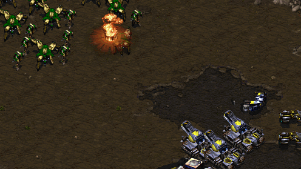
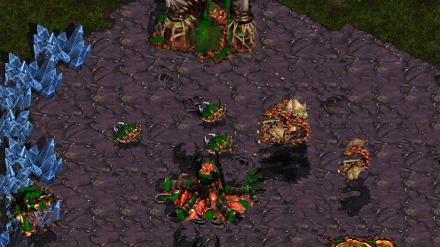
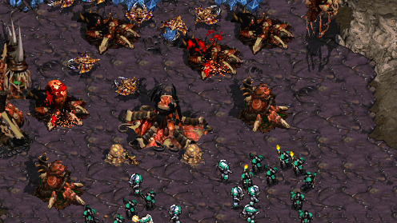

BWMetaAI
========

A Brood War AI designed to follow a metagame closer to modern 1v1 than the original Brood War AI.

Purpose
--------

This project seeks to create an AI that provides a unique experience with each game while closely mirroring builds and unit compositions used by humans to better bring new players up to speed.

This AI should provide a significantly better learning experience for new players. It tends to avoid all-in strategies in favor of an economic focus, but it also includes a number of rushes to make scouting and early defense important. This should encourage learning what the AI is up to and adapting rather than turtling.

Build Orders
------------

The scripts include a number of build orders that have been relatively popular in high level play. Once the initial build is completed, one of several common midgame transitions are used to take the AI into a variety of late game pushes.

### Terran

* Siege Expand
* 1 Rax FE
* 2 Rax FE
* 2 Rax Pressure
* BBS
* 14 CC
* 2 Factory Push
* +1 5 Rax
* 2 port wraith

### Zerg
 
* 5 Pool
* 9 Pool
* Overpool
* 1 Base Muta
* 1 Base Lurker
* 12 Hatch 12 Pool
* 4 Hatch Lair
* 3 Hatch muta

### Protoss

* Forge Fast Expand
* 12 Nexus
* 2 Gate Range Expand
* 10/15 Gate Dragoon Pressure
* 2 Gate Corsair
* 2 Gate Zealots
* Fast DT
* ZcoreZ Expand
* ZcoreZ Reaver

Late game 
---------

Once the AI has many bases and all useful tech, it jumps into a loop of common late game unit compositions.

### Terran

* Mech
* Battlecruisers
* SK in TvZ only

### Zerg

* Muta-ling
* Lurker-ling-defiler
* Ultra-ling-defiler
* Hydra

### Protoss

* Zealot Dragoon Arbiter
* Zealot Archon
* Carriers

Difficulty
----------

This project doesn't seek to create an AI script that performs especially well against either humans or other scripts. Its focus is to follow builds and unit compositions that humans use even if the AI is terrible at executing them properly. 

Advanced techniques such as those used in [BWAPI](https://github.com/bwapi/bwapi) are not used. This project only rewrites the internal AI scripts that Brood War uses to decide what to build next and when to attack. This is done primarily to make it very simple to get up and running.

Micro and building placement are still extremely poor. The AI targets most spells poorly, sieges tanks at terrible times, unburrows lurkers to chase things that have gone out of range, wanders around instead of attacking wall-ins, and makes all sorts of other mistakes that good humans would not.

If you're looking for the most challenging AI experience, this isn't it. However, playing against two or three of these at once can still provide a challenging experience even for decent players. Playing against one AI should provide a good learning environment for a newer player.

With all of that in mind, if you find behavior that you think can reasonably be addressed (e.g. you DT rush a computer and it doesn't attempt to build detection), feel free to open an issue.
